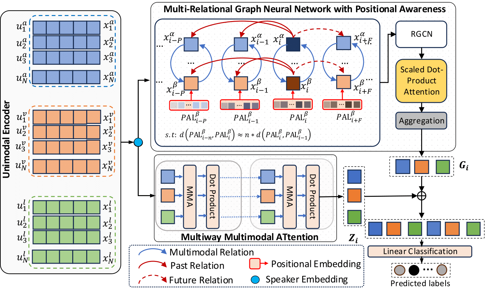

# MERC-MITPA

**MERC-MITPA**: Implementation for MI-TPA, a graph-based and multimodal framework for the emotion recognition task.

---

## Overview
MERC-MITPA is a deep learning framework that leverages graph-based and multimodal approaches for emotion recognition. The framework integrates textual, acoustic, and visual modalities with graph structures to enhance performance on emotion classification tasks.

---

## Framework Architecture


---

## Installation
To install the required dependencies, run:
```sh
pip install -r requirements.txt
```

---

## Preprocessing
Before training, preprocess the dataset using:
```sh
bash run_preprocess.sh
```
This script runs the necessary preprocessing steps on your dataset.

---

## Training
To train the model, use:
```sh
bash run_train.sh
```
This script executes the training pipeline, saving model checkpoints in the `model_checkpoints/` directory.

---

## Evaluation
To evaluate the trained model, run:
```sh
bash run_eval.sh
```
This script computes metrics on the test set.

---

## Results
### Performance Comparison
This is the results on IEMOCAP(4-way) dataset

| Method       | Happy  | Sad    | Neutral | Angry  | Excited | Frustrated | w-F1 (%) | Acc. (%) | Std dev |
|-------------|--------|--------|---------|--------|---------|------------|----------|----------|---------|
| bc-LSTM     | 32.63  | 70.34  | 51.14   | 63.44  | 67.91   | 61.06      | 59.10    | 59.58    | 11.85   |
| CMN         | 30.38  | 62.41  | 52.39   | 59.83  | 60.25   | 60.69      | 56.13    | 56.56    | 10.38   |
| ICON        | 29.91  | 64.57  | 57.38   | 63.04  | 63.42   | 60.81      | 58.54    | 59.09    | 11.28   |
| DialogXL    | -      | -      | -       | -      | -       | -          | 62.41    | -        | -       |
| AGHMN       | 52.10  | 73.30  | 58.40   | 61.90  | 69.70   | 62.30      | 63.50    | 63.50    | 6.98    |
| CoG-BART    | -      | -      | -       | -      | -       | -          | 66.18    | -        | -       |
| DialogueTRM | -      | -      | -       | -      | -       | -          | 69.70    | 69.50    | -       |
| MM-DFN      | 42.22  | 78.98  | 66.42   | 69.77  | 75.56   | 66.33      | 66.18    | 68.21    | -       |
| CFN-ESA     | 53.29  | 80.72  | **69.69** | 68.73  | 74.60   | 67.29      | 70.14    | 70.06    | 8.36    |
| MMGCN       | -      | -      | -       | -      | -       | -          | 65.71    | 65.71    | 9.28    |
| I-GCN       | 50.00  | **83.80** | 59.30   | 64.60  | 74.30   | 59.00      | 65.40    | 65.50    | 11.06   |
| COGMEN      | 55.76  | 80.17  | 63.21   | 61.69  | 74.91   | 63.90      | 67.27    | 67.04    | 7.69    |
| CORECT      | 59.30  | 80.53  | 66.94   | 69.59  | 72.69   | **68.50**  | 70.02    | 69.93    | 5.90    |
| **MI-TPA (Ours)** | **62.69** | 77.59  | 67.17   | **71.04** | **77.52** | 66.04      | **70.39** | **70.36** | **5.23** |

---

## Repository Structure
```
├── data/                # Dataset files
├── model_checkpoints/   # Trained models
├── output/              # Evaluation results
├── preprocess.py        # Preprocessing script
├── preprocess_gc.py     # Graph construction script
├── meld_preprocess.py   # MELD dataset preprocessing
├── train.py             # Training script
├── train_corect.py      # Alternative training script
├── eval.py              # Evaluation script
├── run_preprocess.sh    # Shell script to run preprocessing
├── run_train.sh         # Shell script to run training
├── run_eval.sh          # Shell script to run evaluation
├── requirements.txt     # Dependencies
└── README.md            # Project documentation
```

---

## Citation
If you use MERC-MITPA in your research, please cite:
```

```

---

## Contact
For any issues or questions, please open an issue on GitHub or contact `mattam301@gmail.com`.

